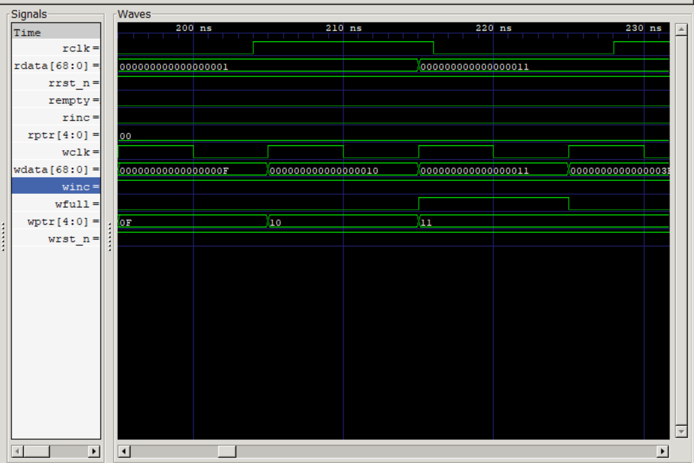
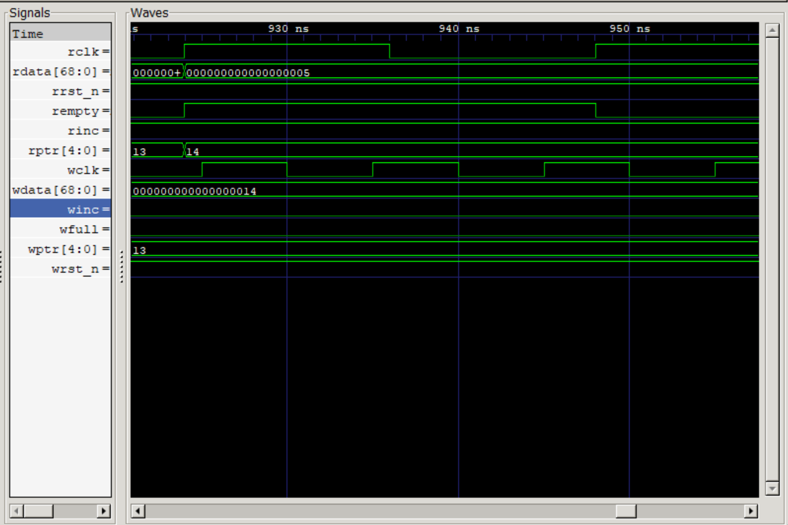
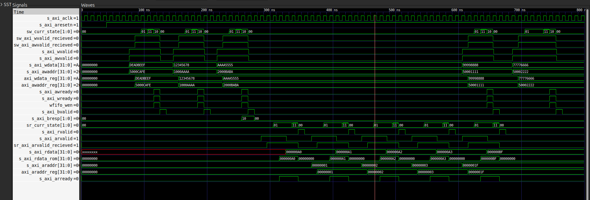
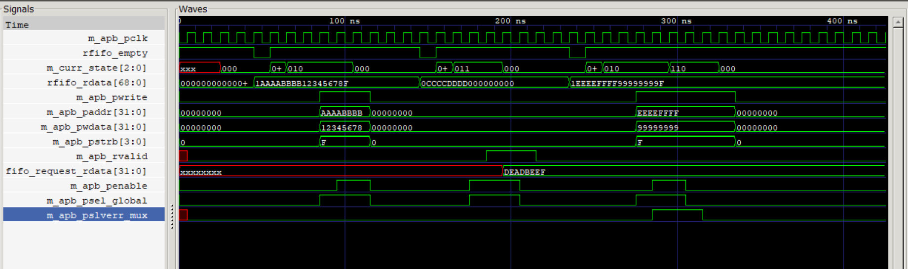

## DESIGN CHOICES
### asynch_fifo_core.v
* gray coded pointers for synchronizing across read and write clk domains, using binary for local usage
* gray code pointers used only empty full logic
* Negedge rst prevent random power spikes in rst track to trigger rst
* rptr_gray_next, wptr_gray_next ensure the empty/full condition flips at correct clk cycle prevent overwrite/reading garbage value
* using rptr/wptr for empty/full logic allows wptr to go above 10(16 height) to 11 while rptr is at 00 essentially overwriting data
* rptr reads a data yet to be published from write side
* 2 main fifos in the structure a write side fifo used incase of either a write request or a read request from the axi side and a response fifo triggered only for sending a read data response back

* fixed using rptr_next, wptr_next(all of this is in gray code)

### axi_slave_fsm.v
* works with elaborative writing tb and with read tb //older test

* also removed the enable to write incase of error and put value of 32'h0
* two major errors resolved incase of write including a pslverr error on the apb_master side incase of a peripheral failure and an address error locally detected with address[31:28]== 4'h2
* read error resolved locally simialr to write case for wrong address being sent to read

* in the write part the valid signals usually come together but might come apart by 1 cycle hence need to be latched and need to have a recieved toggle because for state shift we might not have both high together
* write next state machine reset/base state idle expecting valid signals
* waiting signal recieved one/both signals waits till recieves both to shift to next state and fifo shouldnt be full better stall here than at writing state or else overwrite in latches might happen
* write changes state next cycle without any condition , ensuring that master recives the value 
* response finally changes back to idle when the bready signal comes which says master recieved value

* write state function machine has asynchronous reset
* recieves values to be latched only during idle/waiting state to prevent overwriting during transmission of values, toggle recieved flags to ensure smooth transition from waiting to writing state , latching registers w values
* writing state publishes ready signal to tell master it is sending values , waiting stage cn be skipped directly incase both valid signals come at the same time pushing into writing state but kept one extra stall cycle for waiting preventing harsh signal multiplexing and metatsability issues
* response state tells bvalid saying it has sent values and is resetting 
* signal flow 
    slave side(module) <-- s_axi_awvalid(write addr), s_axi_wvalid(write data) toggle from idle state to waiting to writing state
    slave side --> master(external) wfifo_wen(enable to master to take data), s_axi_awready(sending write addr), s_axi_wready(sending write data)
    slave side(module)--> master s_axi_bvalid, s_axi_bresp signalling peripheral has sent the data safely to master
    master side --> s_axi_bready to fsm that data has been recieved successfully and can be reset for next transisiton

* read next state machine reset/base state is idle expecting the single valid signal for address
* recieves address to be fetched value of from peripheral side, stays waiting for a response till the apb master sends back a s_axi_response containing only the data from the peripheral , accodmodation included for data address/slave address too.

* write state function machine checks for a single valid signal in idle or reading state for address recieving latches the address and the recieved
* signal flow 
    slave side(module) <-- s_axi_arvalid(ready to send address),s_axi_araddr(address)
    slave side-->master s_axi_arready(tell master latched address, recieved is high)
    slave side --> sets busy signal high to prevent spamming of more information till current read finishes sr_wfifo_wen, sr_wfifo_wdata sent via the writig side fifo to the apb master side
    slave side in waiting response state waits for the reposnse fifo the have rfifo_empty as low meaning a reposnse has returned, read for data latched locally when rfifo_ren goes high

### apb_master_fsm.v
* working with the read, write error handling integrated case

* reads incoming value from the read side of the asynchronous fifo incase its not empty and follows the read/write path, switches to error state and resets incase any errors inbound in device
* m_apb_presetn is asynchronous reset, m_apb_pslverr_mux goes high if system has an error, m_apb_busy prevents inputs from coming from the fifo side
* we allow one clk cycle delay as it needs to send rfifo_ren high so the sender knows it can send data sender recieves enable by end of cycle one checked on cycle 2 and immediately sends data if we didnt adjust delay by end of cycle 1 M_IDLE state would move to M_WAITING and make a decision on read/write based on older garbage value 
* M_WAITING sends rfifo_ren again 0 to prevent sending further values decides based on fifo request if it follows write or read path
* in M_READING state sends m_apb_psel_global asking peripheral to wakeup alongside m_pb_penable triggering m_apb_valid when it reads the sent data and sends a recived signal back next cycle reads m_apb_pready goes to M_IDLE state
* M_WRITING has a counter for checking 2 as when it is 1 we write previously latched output and send alongside m_apb_psel_global waking up peripheral next cycle sends m_apb_penable high to ensure value is read on the other side when it recives m_apb_pready goes to M_IDLE state
* if anypoint here instead of M_IDLE it faces an error m_apb_pslverr_mux goes high pushing into M_RESPONSE for error log sets all data exit flags 0 and returns to M_IDLE.

* M_READING has a similar setup for checking 3 counter this ensures all the data has time to efficiently be latched before an enable sends the data to the axi side 
* address sent by the axi side for a read is read and the particular slave's data is chosen from the apb_slave+mux side 

### apb_slave_mux.v
* slave id is given by 4 bits of address as parameter slave number is 16
* all slaves send their data prdata_slaves , only the slave which we need to sample data from holds its one hot encoded value high pready_slaves when m_apb_sel_global goes high, ex slave 5 16'b0000000000010000
* pslverr_slaves and  pslverrmsg_slaves for any sort of error and error message
* sends all this data output
